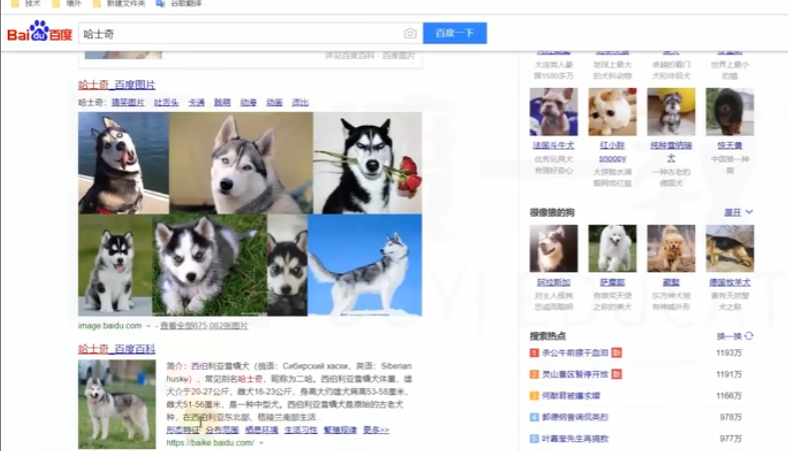

# HTML & CSS

[toc]


这是用paste image 插件来的功能


Emmet插件: 自动生成HTML部分代码

```html
<!--this is a comment-->
```

## 标准的文档结构
```html
<！DOCTYPE> html>
```
文档声明，我使用的标准是HTML5
不写的话，将导致浏览器进入怪异渲染模式。

### Element html
根元素 一个页面就一个。HTML5中没有强制写这个元素

属性：
lang language 比如 lang="cmn-hans" zh-CN 已经过时了

head 和 body 元素都必须是 html 的子元素，虽然说html5可以省略
### head脑子
内容是不会显示的。 charset： 指定网页内部编码

中文汉字的编码表叫 GB2312，台湾 是GBK
UTF-8 是 unicode 的一个版本的编码

一般代码都是写入body元素内

### 空元素
有些元素是没有结尾的 叫空元素
比如 img

关于元素嵌套
一些词：父元素，子元素，祖先元素ancestor，后代元素，兄弟元素

## 语义化是什么

每个html元素都有含义

a 超链接
p 段落
h1 一级标题

所有元素与展示效果无关，因为那是css的工作
不管把一级标题变得多小 他都是一级标题。由于浏览器是默认带有css样式的，所以每个元素都是有样式的

为什么要强调要按照每个元素含义来写html？
为了优化搜索引擎（SEO）。搜索引擎会从整个互联网抓取页面的源代码（html5） 所以要明确区分每个元素

# HTML主要元素

## p9 文本元素
可以搜搜HTML5元素周期表
### h元素
从h1至h6

通过emmet插件：
```html
h1*6 
h1*6>{$级标题}
```

### p元素

### span元素
没有语义，仅用于设置样式


某些元素在显时会独占一行的（块级元素）如 h， p 还有不占一行的叫行级元素或者行内元素
现在已经弃用这种说法了

### pre元素
预格式化文本元素

空白折叠：在源代码中连续空白字符，在页面中会被折叠为一个空白字符

例外：在pre元素中的内容不会出现空白折叠。

通常用于显示代码，它的功能的本质有一个默认的css属性

通常显示代码时 会使用code元素 然后再写pre 元素 ， 或者 只使用code 然后改一下它的空白字符属性:
```html
<code style="white-space:pre">
```

# p10 HTML 实体

实体字符 HTML Entity

实体字符通常用于在页面中显示一些特殊符号

1. &单词; 比如 写 小于符号 **&lt ;** 和 大于符号 **&gt ;** 空格符号 **&nbsp** non-breaking space
2. &#数字; 比如 &#60 

# p11 a 元素

超链接

## href 属性
通常用于表示跳转地址：引用 or hyper reference

1. 跳转地址
2. 跳转到某个锚点：在同个页面内 跳转到 某个位置

某个快速写h元素+p元素的方法：(h2>{章节})+p>lorem1000

id属性：全局属性，表示元素在文档中的唯一编号 比如 chapter2

在href 中写 #chapter2 就能实现锚点

3. 功能链接：触发功能

- 执行js代码, javascript:
- 发送邮件，mailto:
    要求用户计算机上有安装发送软件：微软的exchange
- 拨打电话， tel：
    只有手机端可以触发，或者有安装拨号软件

## target 属性

    表示跳转窗口位置。

    target 的取值
    _self： 在当前页面打开链接
    _blank：在新窗口中打开页面

## title 属性，很简单就不写了


# p12路径的写法

## 站内资源和站外资源
自己网站的资源和其他网站的资源
## 绝对路径

**站外资源 绝对路径**
站内资源 相对路径

1. 绝对路径的书写格式（url）
url 地址：

```
协议名://主机名：端口号/路径
schema://host:port/path

```
https://www.bilibili.com/video/BV1yx411d7Rc
file:///C:/Users/Xinlei%20Lin/Desktop/HTML%20CSS/1/p9.html#

协议名： http, https, file
主机名： 域名，IP地址
域名要定期续费的
端口号：有些是可以省略的，如果https 默认是443。http 是80

绝对路径：当协议相同时 可以省略 协议+：

2. 相对路径的书写格式：
以 ./ 开头 表示当前资源所在的目录
../ 表示上个目录的路径

# p13 图片元素

## img元素
image属性： source
alt属性： 当图片资源失效时，使用代替文字

## a元素联用

## map元素

map 的子元素 ：area

用shift 按住点击可以显示 已经设定的 区域

## figure 元素

指代，定义

子元素 figcaption


# 多媒体元素

## video

controls: 控制控件的显示，取值只能为controls。控件是指播放键之类的东西
style：“with”
这类属性叫 布尔属性 只写 属性名也行

autoplay：自动播放
muted：静音播放
loop：循环播放

## audio
与视频完全一致

## 兼容性
旧版本浏览器 不支持这两个元素
不同浏览器支持的多媒体格式可能不一致
就像是 mp4 webm

为了兼容性 我们会删掉 src属性 然后写个子元素source src=  。 对于每个格式都写一个格式0


